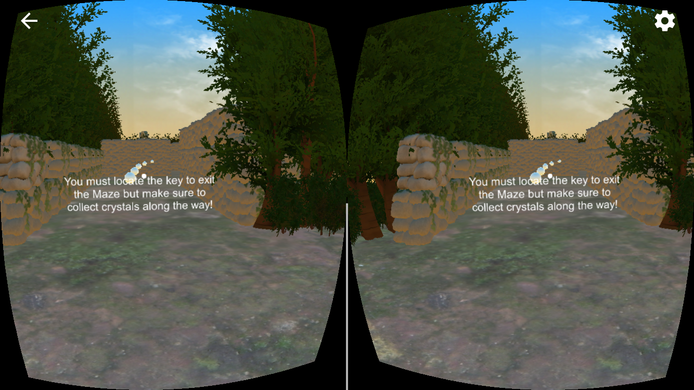
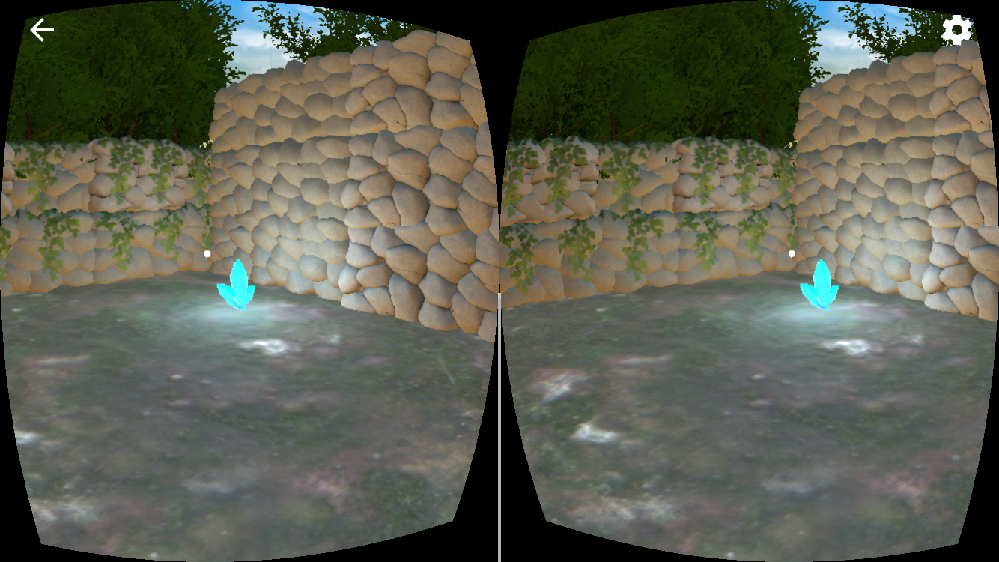
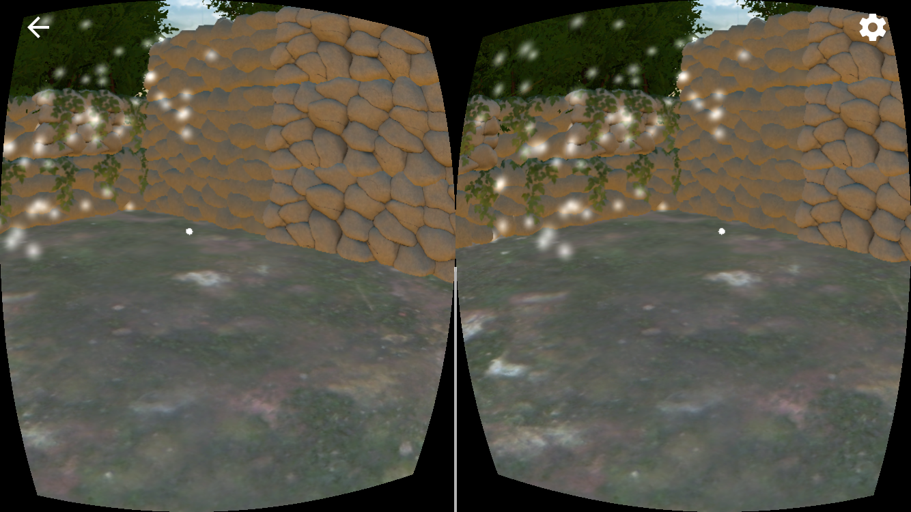
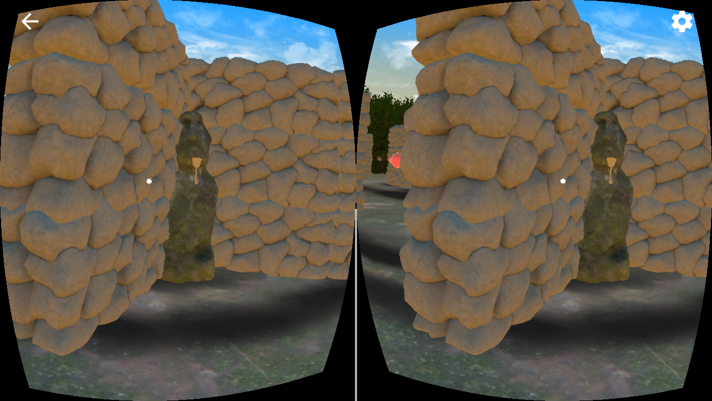
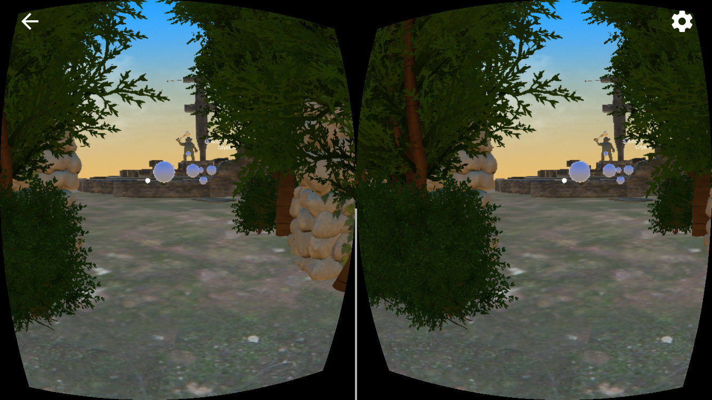
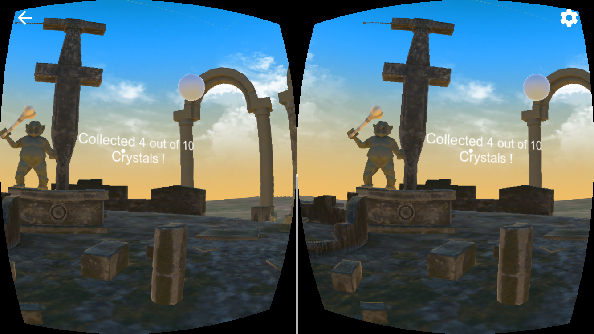

# A Maze  Project

Navigate a maze and collect crystals using Google Cardboard VR Headset.

---
> This project took me about 50 hours to complete. I explored the Unity Asset store for freebies. One great takeaway from this project was learning how to incorporated 3rd party animated assets into my project and becoming more familiar with the animation controller.

> I am quite pleased with the first version I have created as I am in the process of designing what happens next when the user encounters the Troll.

---
## Versions
- Unity 2017.2.0f3
- Google VR Unity SDK v1.70.0
- Submitted and tested on iPhone 6

## Unity Asset Store Acquisitions
- Troll Cannibal from Kazimir 
- Translucent Crystals from Sinevfx
- Idol from Maksim Bugrimov
- Altar Ruins from Ioan Stan
- Stone Wall from Barbara Parkman

## Sounds
- Crystal Tinkle https://freesound.org/people/stijn/sounds/43663/

## Screenshots
- Entering the maze

- Collect a crystal

- Collect the key in order to exit the maze

- Troll celebrates your success!

